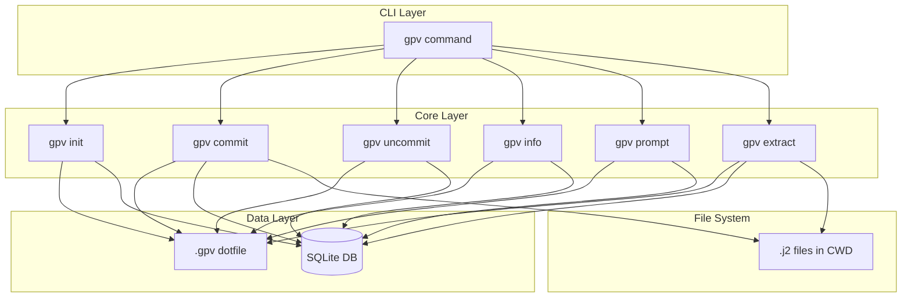

# GPV Design

GPV (graisse-prompt-versioning) is a CLI utility for prompt versioning where the prompt is assembled from jinja2 sub-prompt template files. It relies on a local SQLite database and is developed for macOS.

## Architecture

## Design Principles

- **No defaults or fallbacks:** Missing required values raise errors. This avoids unanticipated bugs and database corruption.
- **Explicit paths:** When paths are required, the user must provide them. gpv operates on files in the current working directory unless the user specifies otherwise.
- **CWD must contain .gpv:** The directory where gpv is invoked must contain the `.gpv` file. When `gpv commit` is invoked with explicit paths (relative or absolute), the `.gpv` in the CWD is used—not the `.gpv` in the target file's directory.

## Prompts and Sub-prompts

Prompts are jinja2 template strings constructed by concatenating multiple jinja2 template documents (sub-prompts). GPV does not assemble prompts; it only stores, tracks, and versions them. Users edit sub-prompts in an external text editor. Sub-prompts are stored in a single directory as `.j2` files.

**Type extraction from filenames:** The sub-prompt type is derived from the filename. For `*_<type>.j2`, the type is the substring after the first underscore and before `.j2`. Examples: `01_intro.j2` → `intro`; `01_intro_section.j2` → `intro_section`. The filename must end with `.j2` and contain at least one underscore. The prefix (e.g. `01`, `02`) defines concatenation order and uses zero-padded numbers so directory listings sort correctly.

## Configuration

### .gpv Dotfile

- **Location:** Must exist in CWD when gpv is invoked.
- **Content:** Single line with the absolute path to the SQLite database file.
- **Validation:** Path must be non-empty and writable. No defaults—if `.gpv` is missing or invalid, raise a clear error.

## Database Schema

### sub_prompts Table

| Column         | Type    | Constraints                          |
| -------------- | ------- | ------------------------------------ |
| id             | INTEGER | PRIMARY KEY AUTOINCREMENT            |
| type           | TEXT    | NOT NULL                             |
| parent_id      | INTEGER | NULL for first of type, FK otherwise |
| version        | TEXT    | NOT NULL, e.g. "1", "1.1", "4.3.1"   |
| contents       | TEXT    | NOT NULL, UNIQUE                     |
| commit_message | TEXT    | NOT NULL                             |
| created_at     | TEXT    | ISO 8601 timestamp                   |

- **Unique contents:** `CREATE UNIQUE INDEX idx_sub_prompts_contents ON sub_prompts(contents);`
- **Type extraction:** See "Type extraction from filenames" under Prompts and Sub-prompts.

### master_prompts Table

| Column         | Type    | Constraints                                    |
| -------------- | ------- | ---------------------------------------------- |
| id             | INTEGER | PRIMARY KEY AUTOINCREMENT                      |
| parent_id      | INTEGER | NULL for first master, FK to master_prompts.id otherwise |
| version        | TEXT    | NOT NULL                                       |
| contents       | TEXT    | NOT NULL, UNIQUE (JSON list of sub_prompt IDs) |
| is_current     | INTEGER | 0 or 1, NOT NULL                               |
| commit_message | TEXT    | NOT NULL                                       |
| created_at     | TEXT    | ISO 8601 timestamp                             |

- **Parent chain:** Each master has `parent_id` pointing to its predecessor. The first master has `parent_id = NULL`. Enables `gpv uncommit` to always revert to the correct previous master.
- **Single current row:** `CREATE UNIQUE INDEX idx_master_prompts_current ON master_prompts(id) WHERE is_current = 1;` — ensures only one row has `is_current = 1`.
- **Unique contents:** `CREATE UNIQUE INDEX idx_master_prompts_contents ON master_prompts(contents);`

### Schema Creation (gpv init)

- Create database file if it does not exist.
- Migrations are allowed only when all tables to be added are absent. The database need not be empty; the requirement is that it must not already have a `sub_prompts` or `master_prompts` table. In that case, create both tables and indexes in a transaction.
- If either table is already present → error.

## Versioning

### Sub-prompt Version Numbers

- **Simple increment:** Parent `4.3` → child `4.4` (increment last segment).
- **Branch:** Parent `4.3` → child `4.3.1` (append `.1`).

Version strings are period-separated integers. The first row of a type has `version = "1"` (parent is null).

### Master Prompt Version Numbers

- **Source:** Derived from the row where `is_current = 1` (the "current" master prompt).
- **Branched:** If any sub-prompt in the new master is newly branched vs current.
- **Simple increment:** Otherwise.

**Branched sub-prompt:** A sub-prompt whose version has more segments than the corresponding one in the current master (e.g. current has `4.3`, new has `4.3.1`).

**First master prompt:** When the `master_prompts` table is empty, use version `"1"`.

## Commands

### gpv init

1. Resolve CWD, look for `.gpv` in CWD.
2. If `.gpv` missing → error.
3. Read DB path from `.gpv`; if empty/invalid → error.
4. Create DB file if it does not exist.
5. If both `sub_prompts` and `master_prompts` are absent → in a transaction, create both tables and indexes. If either table is already present → error.

### gpv commit commands

All commit variants create a new master prompt. Master prompt insert and update are performed in a single transaction.

**gpv commit [-no-j2-validate] -m "{message}"**

- Full commit includes only types with files in CWD. Types in the current master whose files were removed from CWD are dropped from the new master.
- Scan CWD for `*.j2` files. Non-.j2 files are always ignored.
- Optional jinja2 validation (default: yes); use `-no-j2-validate` to skip.
- For each file: compare contents to `sub_prompts`; if different and not already stored, insert new row. Parent = sub-prompt whose FK appears in the current master prompt's contents (JSON list) and whose type matches; if none, parent is null.
- Build new master prompt: list of sub-prompt IDs (use new IDs where updated, existing where unchanged).
- In a single transaction: insert new master_prompts row with `is_current = 1` and set previous current row to `is_current = 0`.
- If no `.j2` files or no changes, exit with a message saying nothing was done.

**gpv commit [-no-j2-validate] -m "{message}" {path} [{path} ...]**

- Same as above but only process the listed file paths. Paths are relative to CWD or absolute. Validate each path exists. Non-.j2 files are ignored.

**gpv commit [-no-j2-validate] -branch {parent_pk} {path} [-branch {parent_pk} {path} ...] -m "{message}"**

- Each `-branch` takes two arguments: parent PK and path. May be repeated to branch multiple sub-prompts in a single invocation.
- Force branch versioning for each specified sub-prompt.

### gpv uncommit

1. Find current master prompt (`is_current = 1`).
2. Find previous master via `parent_id` (no user-specified PK).
3. In a single transaction: delete the current master prompt row, set the previous row to `is_current = 1`, and delete the sub-prompt rows that were inserted in the last commit (those not in the previous master but in the current).

Requires user confirmation before proceeding. Every commit is reversible because the parent chain guarantees the correct previous master.

### gpv info

Print details of current master prompt: id, version, commit_message, created_at, list of sub-prompt IDs (and optionally their types/versions).

### gpv extract

- Creates files in the current directory, one per sub-prompt in the current master prompt. Each file contains the sub-prompt contents.
- Filenames are generated from the type in the reverse of the manner used in gpv commit.
- Requires user confirmation if any target file already exists (would overwrite).

### gpv prompt

- Print concatenated contents of all sub-prompts in the current master prompt, in order. Each sub-prompt is preceded by its type.
- `gpv prompt -key {pk}` — same as above but for the specified master prompt.

## Error Handling

- **No defaults:** Every missing required value (DB path, message, paths) raises an error.
- **Explicit paths:** When paths are required, user must provide them.
- **No repeated types in master:**
  - Each sub-prompt type may appear at most once in a master prompt. `gpv commit` raises two distinct errors: (1) `DuplicateTypeInCommitError` when multiple files in the commit share the same type; (2) `DuplicateTypeInCurrentError` when the current master already has duplicate types (e.g. from manual DB edits).
  - When adding types not in the current master, the commit must include all current types (full commit). Partial commits that only update existing types are allowed. `PartialCommitAddsNewTypeError` is raised when a partial commit would add new types.
  - Partial commits require every uncommitted type (in current master but not in the commit) to have a corresponding `.j2` file in CWD. `PartialCommitMissingCwdFileError` is raised when a partial commit would keep a type that has no file in CWD. This is necessary to define the order of the sub-prompts.
- **Duplicate content:** Attempt to insert duplicate `contents` → IntegrityError, surface to user.
- **Uniqueness violations:** Partial unique index on `is_current` → clear error on failure.

## Future Work

- **Template format:** For the moment we only handle jinja2 prompt files (`.j2`). This could easily be expanded in the future to support other template formats.
- **gpv rollback:** Roll back to a specified master prompt (by PK or version), making it current. Differs from uncommit in that it can target any historical master. Requires confirmation.
- **gpv stash:** Stash the current working directory's `.j2` file contents (and possibly the current master state) for later restoration.
- **gpv unstash:** Restore stashed contents to the working directory. Requires confirmation if files would be overwritten.
